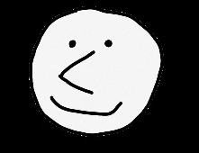
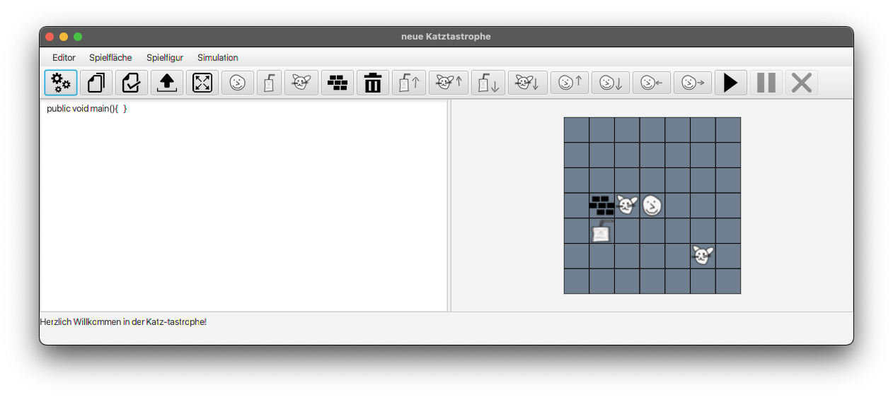

<h1 align="center">Katz-tastrophe - eine Miniatur Programmier Lernumgebung</h1>

<p align = "center">


In Rahmen eines Universitätsmodul der Carl-von-Ossietzky Universität Oldenburg wurde dieses Programm im Wintersemester
2021/22 geschrieben. Ziel dieses Programmes ist es Programmierneulinge an das Konzept des objektorientierten Programmierens heranzuführen.
Er kann sowohl die unten aufgeführten Befehle innerhalb einer Main-Methode eingeben und ausführen lassen, als auch außerhalb der Main-Methode
neue Methoden schreiben und Variable definieren und diese dann in der Main-Methode aufrufen.

Sofern nicht anders am Anfang einer Methode angemerkt, wurde sämtlicher Code von Grund auf selber geschrieben.

## Voraussetzungen

Es wurden keine anderen Programme oder Frameworks benutzt. Zum Ausführen wird somit lediglich Java 11 oder höher und Maven benötigt.

## Setup über die Kommandozeile

1. Sollte das Programm über die Kommandozeile ausgeführt werden sollen, so müssen folgende Kommandos eingegeben werden:

   ```sh
   $ git clone https://github.com/RCRDMK/Katz-tastrophe
   $ cd Katz-tastrophe
   $ mvn package
   $ cd target
   $ java -jar Katz-tastrophe-1.0.jar
   
Diese Methode erfordert jedoch neben Java 11 und Maven zusätzlich noch eine Git Installation.

## Über das Projekt



In Katz-tastrophe versucht der Akteur Sebastian sich aus der Küche etwas zu trinken zu holen. Leider befinden
sich auf den Weg dahin Katzen, welche nicht aus dem Weg gehen wollen. Der Spieler hat nun die Wahl entweder um die
Katzen drum herum zu gehen oder über sie herüber zu steigen. Steigt er über sie rüber, dann teilen sich Katze und Akteur
kurz das Feld.

In der Küche angekommen kann der Spieler nun das Trinken aufnehmen und zurück gehen. Hierbei ist zu beachten, dass der
Akteur entweder nur Trinken oder eine Katze, aber nicht beides tragen kann. Auch kann er nur eine Einheit davon auf
einmal tragen.

Solange der Akteur Trinken trägt, kann er nicht über Katzen herüber steigen, da er sich bei dieser Aktion mit seinen
Händen, wegen der eingeschränkten Trittfläche, welche er sich kurzzeitig mit der Katze teilt, ausbalancieren muss. Wenn es
keinen Weg um die Katze herum, sondern nur über sie rüber, gibt, kann der Spieler das Trinken ablegen und in einem
Quadrat um sich rum legen. Angelehnt an den Hamster-Simulator befindet sich der Akteur in einer Kachelwelt. Hindernisse
auf die er trifft sind Wände, wobei Katzen und Trinken als passive Gegenstände realisiert wurden.

## Befehle

void lookHere(String blickrichtung): Lässt den Akteur in die gewählte Richtung blicken, ohne dass er sich bewegt.
Gültige Eingaben hier sind „up“, „down“, „left“ und „right“.

void moveUp(): Bewegt sich auf das Feld überhalb des Akteurs. Nicht möglich, wenn dort eine Wand oder Trinken ist.

void moveDown(): Bewegt sich auf das Feld unterhalb des Akteurs. Nicht möglich, wenn dort eine Wand oder Trinken ist.

void moveLeft(): Bewegt sich auf das Feld links vom Akteur. Nicht möglich, wenn dort eine Wand oder Trinken ist.

void moveRight(): Bewegt sich auf das Feld rechts vom Akteur. Nicht möglich, wenn dort eine Wand oder Trinken ist.

void takeCat(): Nimmt die Katze auf, auf die der Akteur gerade anschaut. Zusätzlich wird geprüft ob die Hände des
Akteurs frei sind. Sind sie es, dann wird in der dazugehörigen Variable markiert, dass der Akteur momentan eine Katze
trägt. Sind die Hände schon belegt, wird die Katze nicht aufgehoben.

void takeDrink(): Nimmt das Trinken, welches der Akteur gerade anschaut. Zusätzlich wird geprüft ob die Hände des
Akteurs frei sind. Sind sie es, dann wird in der dazugehörigen Variable markiert, dass der Akteur momentan Trinken
trägt. Sind die Hände schon belegt, wird Trinken nicht aufgehoben.

void putCatDown(): Wenn eine Katze aufgehoben ist, wird sie in der Richtung abgelegt, in welcher der Akteur gerade
schaut.

void putDrinkDown(): Wenn Trinken aufgehoben ist, wird es in der Richtung abgelegt, in welcher der Akteur gerade
schaut.

Boolean handsFree(): Überprüft, ob die Hände des Akteurs frei sind. True wird zurückgegeben, wenn sie es sind und False
falls die Hände nicht frei sind.

Boolean catThere(): Überprüft, ob auf dem nächsten Feld der momentanen Blickrichtung des Akteurs eine Katze liegt. Liegt
dort keine Katze wird False zurückgegeben und True wenn eine Katze vor ihm liegt.

Boolean stepOverCatPossible(): Überprüft, ob es möglich ist über Katze rüber zu steigen. True wird zurückgegeben, wenn
es möglich ist und False wenn es nicht möglich ist.

## Lizenz

Der Code dieses Projektes untersteht der GNU General Public License. In der LICENSE Datei sind hier zu weitere
Informationen zu finden.
